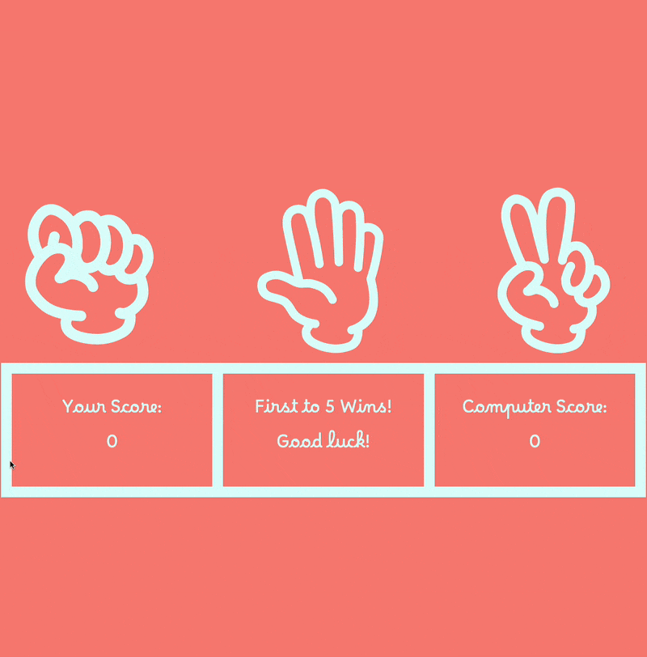

# Rock, Paper, Scissors Project! 

A live implementation of the project can be found on this 
[GitHub Pages link](https://emannuelmartineztest.github.io/rock-paper-scissors/).

## Initial goals with the project
Since we had already started off with a CLI version of the game earlier in the program, I had a lot of the game-logic 
pretty much already figured out.

So I really just wanted to challenge myself in the UI version by implementing things and working with technologies 
that I hadn't before.

Here's the list of technologies/ideas I wanted to implement in my project:
- `.sass`/`.scss`
- CSS animations
- DOM manipulation
- Git + GitHub
    - Git, to manage and push the project to my GitHub repo
    - GitHub, so I can figure out how to publish my repo as a Page
- Prettier
- `@container` queries
- Multiple browser compatability
  - Including iOS, iPadOS, FireFox, Safari, and Chrome

So I'm pretty happy to report that I was able to implement pretty much everything I wanted!
There were definitely a few head-scratching moments in there, which I'll detail further down below, but overall I 
had a blast working on this project.

## Things to add in the future
Even though I was pretty happy with how it turned out, there are definitely a few features that I think would
bring this project over the line. 
- TypeScript `.ts`
  - Just because it seems useful to learn
- Testing `.jest`
  - Especially since I was manually playing all games to the end to make sure my reset button would pop-up
- Multiple difficulty modes
  - **Easy** -- create a sequence starting from either rock, paper, or scissors and just start looping endlessly
  - **Normal** -- pick moves at random
  - **Impossible** -- have the computer actively cheat and always pick the winner

But other than the multiple difficulties mode, these are more-so for my sake than on polishing the game itself.
I'm satisfied with how the game looks and plays overall, but I know a future version of me will scoff at it. 

## Technical details and difficulties
Now here is where I write about all the difficulties I had.
They go from mild annoyances, to literally losing sleep over it. So, let's start!

### SVG Viewboxes
I try and keep things as semantically correct as I know how, I'm sure I'm doing a million-and-one things wrong in
this area, but I do my best. 

However, just getting my images to line up with my button had me learn about the wonderful world of `<svg>` 
and its `viewBox` attribute. 

So a few things 
- I had to set the `ponter-events: none;` on every descendent of the button, since the `evt.target` flag would never actually
target the button element itself, but either the containing `<svg>` or `<path>` elements.
- `transform` was extremely useful, since it allowed me to use the same SVG but just manipulate the direction it was facing.
  - `rotate()` helped me rotate the item in-place, along with the `transform-origin` property.
  - `rotateY(3.142rad)` flipped the image on the y-axis, since `rotate()` on its own would make the images appear upside-down.

And that's it! ...or so I thought, but we'll save that for the last point.

### Issues with animation, and learning about references vs values
The hardest part of the animations was just figuring the timing of it all. Since I purposefully didn't want each round to 
end immediately like I saw in other implementations, I wanted there to be a little something in-between to keep the 
player engaged. 

So my goal was to implement the following animation sequence:
1. Make your choice
2. All the choices fly up
   1. Once up, manipulate the DOM to only display the user and computer choices
   2. Rotate the choices, so they're facing each other
3. Bring them down to show the results of the round
4. Fly the container up again, reset the choices, bring it all back down again to begin the loop over. 

The `.js` was fairly standard, the hardest part was just figuring out how long each round would last and time the 
`setTimeout()` code to match with the choices going off-screen.

***But here's where my biggest issue was!* i.e., why it's important to know the difference between references and values.**

I initially just `querySelector()`'d all the items I needed (i.e. the `.choices` container and the individual `.rock`, `.paper`,
`.scissors` buttons) and kept those as variables at the top. And I figured that as long as I never manipulated them
directly, it would be fine for me to just grab and drop them in my `.choices` container whenever I needed to replace 
the buttons. 

But as my container would come down, I'd only sometimes have all three choices on screen. Sometimes it'd only be two, and
other times it'd only be a single choice. This made me think there was something wrong with my game-logic, but after 
combing through it all and running it temporarily as a CLI game, I realized that there must be something else going on.

And after doing some digging (and here's my personal shout-out and thanks to the wonderful people who post on the 
forums and answer-boards every day), I figured out that in the case where the user and computer made the same choice, 
I was *supposedly* inserting two distinct instances of the choice itself, but in fact, it was the same choice twice! 
Meaning as soon as it would plunk one down, it would pluck it up and plunk it down again for the other choice. 

***My solution***

I figured that the most direct way to solve this issue would be to just create a clone of each item I needed, meaning 
there existed multiple copies if-need-be instead of just referencing the single copy, and that rendered everything properly.

### Issues with browser compatability

#### Preamble
I'll start off by saying that I use WebStorm as my IDE, as I've always favored beefier and more robust systems that have a
learning curve because it typically means you could do more with them long-term. Whether this is true or not, only
time will tell. But I've been enjoying the process so-far.

I also run my live server through my browser of choice, which is FireFox Developer Edition. Which means that some 
lessons on TOP aren't directly applicable as they use Chrome. But again, FFDE is plenty robust, so it's actually been 
a little fun challenge to see what my browser's equivalents are while working through the curriculum.

So as I finish up the project, everything is looking great, and I decide to finally publish the page.

 - As an aside, once you actually push save on the Pages tab within Settings, go immediately to the Actions tab on
the repo itself. That's where you can actually see in-real-time how the build is going. It took me an hour before I
realized I hadn't set-up my directory properly, but the Pages tab wouldn't even give me a live link to verify it.

#### Actual issue
I finally get the live link, and it works just as intended. Excellent! I share the link with friends...but there's a problem.

***THE HANDS WON'T LOAD!!!***

I asked them how they were playing the game, and they all pretty much said that they were using the safari app on either
iOS or iPadOS. I check on my own device to verify, and sure enough, none of the icons were loading. 

I have to keep a pretty strict time-schedule, and since I only had around 10 minutes left in the day to debug the issue, I think the 
scrambly nature of my brain just didn't even let me think as to what could have possibly gone wrong. And as my time was up,
let's just say that I didn't sleep all that comfortably.

The next morning, I tried to think of everything that could have gone wrong. I noticed that when I deleted the `viewBox` 
property, it would sort-of work, but now the items wouldn't rotate as I had implemented them to. And since I didn't 
want to have to refactor the entire rendering pipeline to work around this issue, I just looked up "SVG not rendering correctly
inside of a button iOS" and hoped someone had figured this out.

One suggestion I read was to set the `height` and `width` values on `viewBox` as 100%, but that gave me the exact same
situation before where the hands still didn't fit fully within the space of the button, and I couldn't rotate them in-place
either. 

Then, I found it.

It turns out that on iOS/iPadOS, and safari in general (I verified this afterward, it wasn't working on the web 
version of Safari, and it also wasn't working on the iOS version of FireFox) will NOT render an SVG if it doesn't 
have a `height` or a `width` defined on it directly!!! Once I set both to 100%, it all rendered normally, and all was good. 

